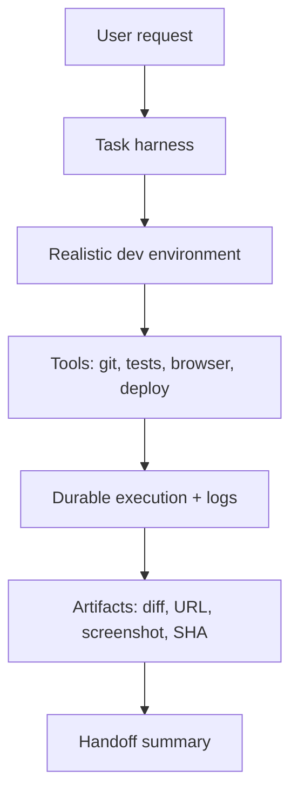

# Durable Agent Runner Stack

```mermaid
flowchart TB
  U[User request] --> H[Task harness]
  H --> E[Realistic dev environment]
  E --> T[Tools: git, tests, browser, deploy]
  T --> D[Durable execution + logs]
  D --> A[Artifacts: diff, URL, screenshot, SHA]
  A --> S[Handoff summary]
```

**Acceptance test:** if the user cannot inspect what happened, the runner is not production-ready.
